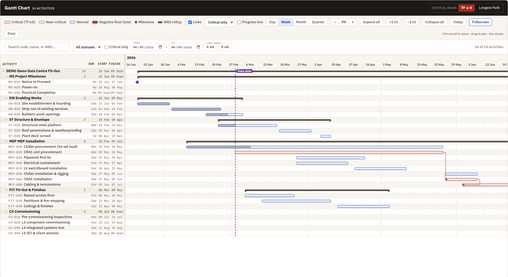
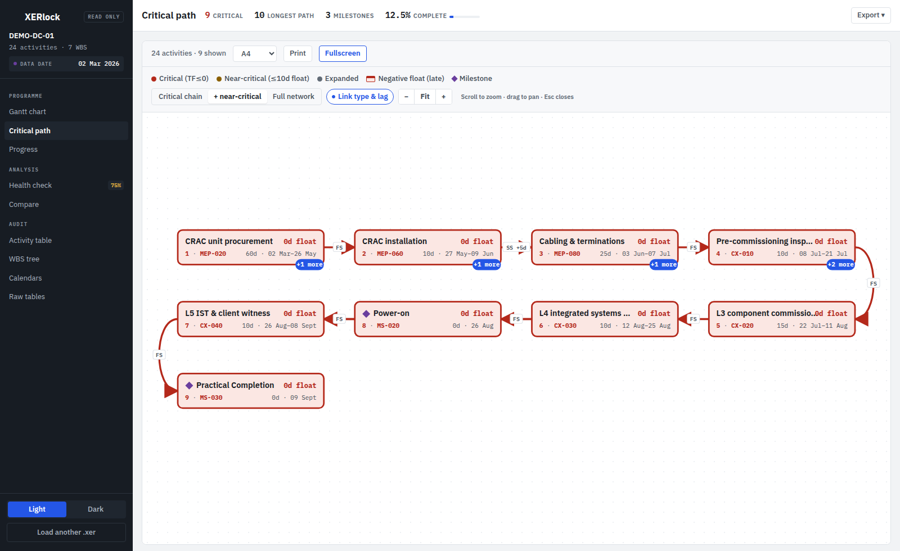
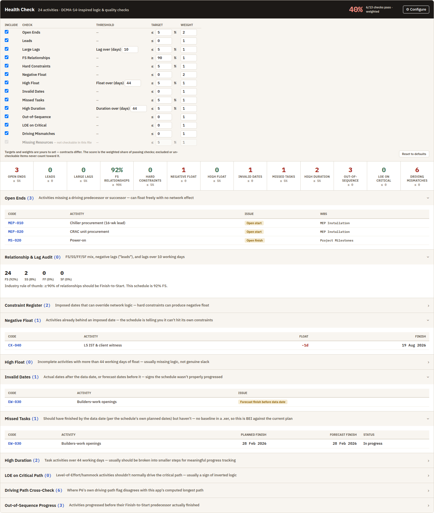
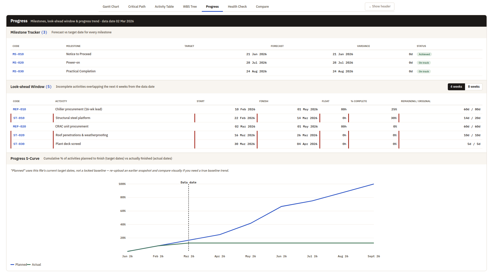
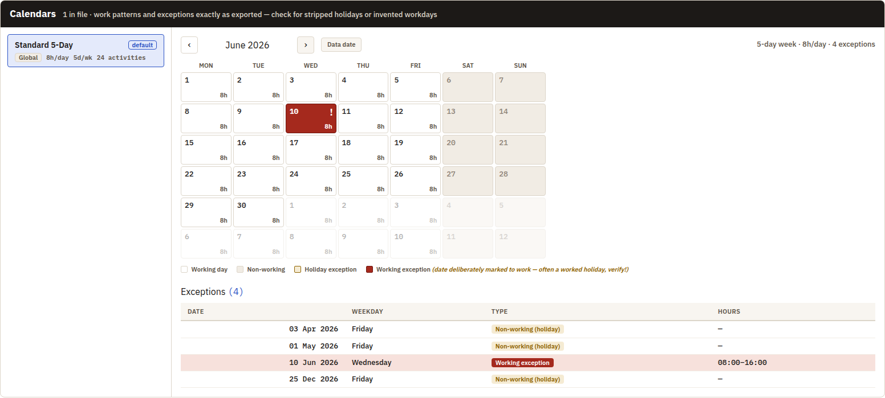
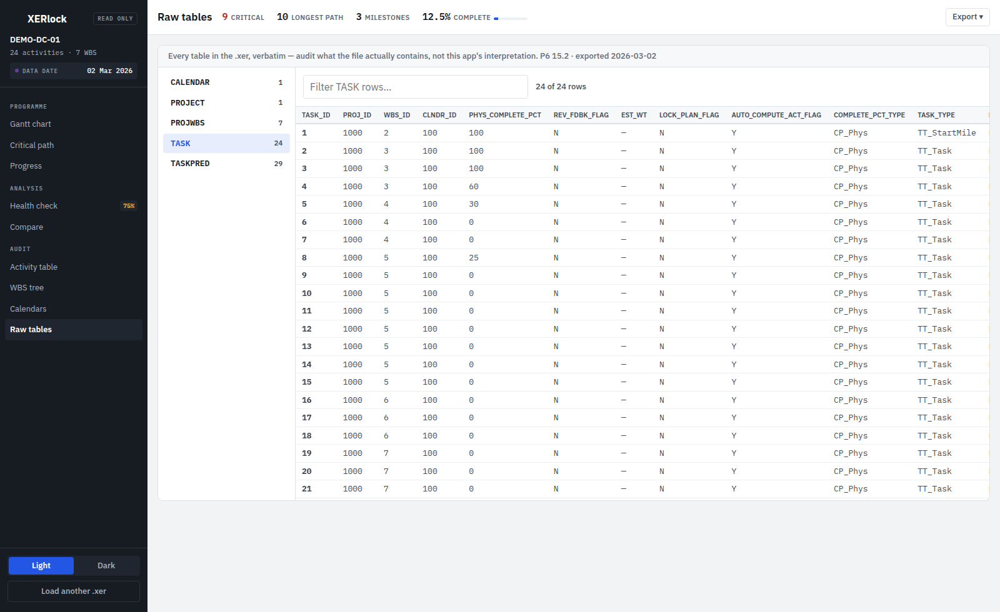

# XERlock

   

**Review a contractor's programme in full - without a P6 license.** Upload a `.xer` export and get
an interactive Gantt chart, a critical-path network diagram, configurable DCMA-14-style schedule
quality checks, calendar and raw-table inspection, progress tracking, and snapshot comparison -
everything a planner needs to review a schedule in detail, self-hosted so the file never leaves
your own infrastructure.

The name is the promise: XERlock is **locked read-only**. It never modifies, never re-saves, and
never stores your `.xer` - files are parsed in memory and discarded.

**Try it locally** - one click loads a sample data-centre fit-out, or
upload your own `.xer` (parsed in memory, never stored).

Built for project controls professionals: the checks, terminology, and defaults follow how
schedules actually get reviewed (total float severity bands, longest-path vs TF≤0 critical basis,
open-end detection, lag/lead audits, out-of-sequence progress).


*Critical-path links drawn above the bars - logic never hides behind unrelated activities. Chain
tracing rebuilds an activity's driving path link by link.*

## Features

**The shell** - a sidebar grouping the nine views as *Programme* / *Analysis* / *Audit*, with
the project, its data date and the Health Check score always in view. Light and dark themes,
both real, with the semantic state colours re-lit per theme so criticality never changes
meaning. Works down to a phone, where the sidebar slides over from a hamburger.

**Gantt Chart** - the primary view
- WBS-hierarchical activity grid with duration, start, finish and **float** columns, float
  colour-coded by the same severity bands as the bars
- Continuous zoom (presets + Ctrl/scroll), drag-pan, fit-to-width, resizable activity column
- Critical-path link overlay drawn *above* bars so logic never hides behind unrelated activities
- Two critical-basis modes: TF ≤ 0 or Longest Path (driving-chain trace from the finish)
- Progress line, today + data-date markers, weekend shading, filter bar (text/status/critical/
  activity codes/date window with 4- and 8-week look-ahead presets from the data date)
- Float tails: a dashed line off each bar end, proportional to total float, so slack is visible
  in the chart rather than a number to look up
- Baseline ghost bars: with a Compare baseline loaded, every activity draws a hollow bar at its
  baseline position - slips read as horizontal offsets, right in the Gantt
- Docked detail panel (it does not cover the chart): stat tiles, and a **driving chain** showing
  the driving predecessor, this activity, and the driving successor with the link type and lag
  per hop - click a node to walk the chain. What is not driving sits in collapsed lists
- Print-friendly export

**Critical Path** - activity-on-node network diagram

- Dagre-based DAG layout folded into a "snake" so long chains stay readable
- Scope control: critical chain / + near-critical / full network; expand hidden neighbours on demand
- Nodes are name-led and ranked by position along the driving chain, so the diagram reads as a
  sequence; link type and lag are labelled on each edge (`FS`, `SS +5d`)
- Pan/zoom canvas with the same docked detail panel and jump navigation

**Health Check** - configurable DCMA-14-inspired logic & quality scorecard

- 15 checks: open ends, leads, large lags, FS-relationship mix, hard constraints,
  **ALAP constraints** (flagging which of them sit on the critical path), negative float,
  high float, invalid dates vs the data date, missed tasks (BEI against the current plan),
  high-duration activities, out-of-sequence progress, LOE-on-critical-path anomalies,
  driving-path cross-check against P6's own flag, missing resource assignments
- Failures are cards in the state colour, passes collapse into a quiet pill strip and
  un-checkable items are a footnote, so what needs attention reads pre-attentively
- **Configurable**: per-check include/exclude, thresholds, targets, and weights (contracts differ)
  roll up into a weighted overall score; your settings persist in the browser
- Honest by design: checks that can't run on a given file are labeled as such and never
  counted toward the score
- Every finding is one click away from the activity in the Gantt

**Progress** - status-date-anchored monitoring

- Milestone tracker with target-vs-forecast variance
- 4/8-week look-ahead window with remaining vs original durations
- Planned-vs-actual S-curve anchored to the schedule's data date

**Calendars** - the check most tools can't do without P6

- Month-by-month browser for every calendar in the file: weekly work patterns, holiday
  exceptions, and - highlighted loudly - **working exceptions**, i.e. dates deliberately marked
  to work that would normally be holidays. Stripped holidays and invented workdays are a classic
  way a programme gets quietly compressed, and they're invisible to date-based checks.
- Full exception register per calendar, plus which calendars are actually assigned to activities

**Raw Tables** - audit-grade file inspection

- Every table in the `.xer` exactly as exported (`TASK`, `PROJWBS`, `CALENDAR`, `TASKPRED`,
  UDFs, …) with filter, sort, pagination, and a per-row record view - verify what the submission
  actually contains rather than trusting any tool's interpretation (including this one's)
- Shows P6 version and export date from the file header; correct accented characters even for
  cp1252 exports

**WBS Tree** - roll-up per node
- Critical count, activity count, span and progress for every branch, aggregated from its
  descendants, so a branch's shape reads without expanding it

**Compare** - diff two `.xer` snapshots
- Leads with the verdict: project finish baseline → current with the day delta, then milestone
  dumbbell chart (baseline ● - ● current per milestone) and a slip tornado of the biggest
  movers - tables below for drill-down
- Date slips, duration edits, float erosion, critical-path churn (with a stability score),
  logic changes, added/removed activities
- **Snapshot register**: save the current parse in the browser (IndexedDB) and diff
  against it next month - no need to keep old `.xer` files at hand; nothing leaves
  the browser
- Activities matched by code (stable across re-exports), not internal IDs

**Review workflow**
- Attach notes with severity tags (Query / Risk / Logic Issue / Resolved) to any activity;
  flags show across every view, persisted in your browser per project
- Export an annotated Review Report (.xlsx), a full schedule workbook, or filtered CSVs
- The app remembers your last opened file (browser-local) for one-click reopening

## Try it

The **Load the sample project** button on the upload screen loads a synthetic 24-activity
data-centre fit-out (realistic logic, a critical path, negative float, in-progress work) - the
same file ships in [`examples/sample-schedule.xer`](examples/sample-schedule.xer).

## Architecture

```
┌────────────┐  .xer upload   ┌──────────────────┐
│  Vue 3 SPA │ ─────────────▶ │ FastAPI backend   │
│  (Vite)    │ ◀───────────── │ + PyP6XER parser  │
└────────────┘  parsed JSON   └──────────────────┘
```

- **Backend** (`backend/main.py`): FastAPI + [PyP6XER](https://github.com/HotaOsman/PyP6XER).
  One endpoint (`POST /api/upload`) parses the `.xer` in memory and returns the full schedule as
  JSON - activities with float/constraints/actuals/codes, the WBS tree, and project stats
  including a longest-path trace. **Nothing is persisted server-side**; files are parsed and
  discarded.
- **Frontend** (`frontend/`): Vue 3 (Options API) + Vite. No UI framework - hand-rolled CSS on a
  design-token system. [dagre](https://github.com/dagrejs/dagre) computes the network layout;
  [ExcelJS](https://github.com/exceljs/exceljs) (lazy-loaded) generates the Excel exports.
  Annotations and the last-opened file live in `localStorage` only.
- In production, FastAPI serves the built frontend from `frontend/dist/` - a single container
  runs everything.

## Run locally

Requires Python ≥ 3.10 and Node ≥ 18.

```bash
# backend
python3 -m venv .venv
.venv/bin/pip install -r requirements.txt
.venv/bin/uvicorn backend.main:app --reload --port 8000

# frontend (separate terminal)
cd frontend && npm install && npm run dev
```

Open http://localhost:5173 - the dev server proxies `/api` to the backend on port 8000.

## Deploy

**Docker (recommended):**

```bash
cd frontend && npm install && npm run build && cd ..
docker compose up -d --build
```

Or without compose:

```bash
docker build -t schedule-app .
docker run -d -p 8000:8000 schedule-app
```

The container serves the whole app on port 8000. Put your reverse proxy of choice
(Traefik, Caddy, nginx) in front for TLS.

> The frontend must be built (`npm run build`) *before* the image build - the Dockerfile copies
> `frontend/dist/` rather than running Node inside the image, keeping it a slim single-stage
> Python image. If you prefer building inside Docker, a multi-stage
> `node:20-alpine → python:3.12-slim` Dockerfile works too.

## Tests

```bash
pip install -r requirements-dev.txt && pytest        # backend: parser, calendars, API
cd frontend && npm install && npm run test:run       # frontend: pure utils, geometry
```

The backend suite pins the numerically load-bearing behaviour — longest-path trace,
driving-relationship flags, float/day conversion, the display-date convention, calendar
exception decoding — plus the API contract, including that no uploaded file survives the
request. Both suites run on every push (`.github/workflows/test.yml`).

## Development notes

- All colors/typography/spacing are CSS custom properties defined once in `App.vue` (`:root`
  block). Semantic status colors (`--crit`, `--near`, `--ok`, `--ms`) mean the same thing in
  every view, in both themes - don't introduce new colors for criticality states.
- A class used by more than one component belongs in `App.vue`'s global block. Left in a
  component's `scoped` block it silently renders unstyled everywhere else, with nothing in the
  console - this has bitten `.btn-tiny-light`, `.btn-tiny`, `.ctrl-btn` and `.tb-chip`.
- The Gantt deliberately avoids `position: sticky` for its frozen header/label column
  (Chromium mis-renders sticky grid items near scroll boundaries); positions are tracked
  manually from the scroll handler. See comments in `GanttChart.vue`.
- Numeric text (codes, dates, durations, floats) renders in tabular monospace app-wide.
- Timeline maths lives in `utils/ganttGeometry.js` and paper sizes in `utils/paper.js`,
  both pure and unit-tested; `mixins/fullscreen.js` carries the fullscreen lifecycle shared
  by the two charts. The charts' pan implementations are deliberately *not* shared — the
  Gantt pans a scroll container, the network diagram pans an SVG transform.
- `docs/DESIGN_TOKENS.md` is the reference for the design system (generated from `App.vue`:
  every token, its value, which themes override it, and which components consume it).

## License

[MIT](LICENSE). Depends on [PyP6XER](https://github.com/HotaOsman/PyP6XER) (LGPL-2.1, used as an
unmodified library), dagre, ExcelJS, Vue, and IBM Plex fonts (OFL, loaded from Google Fonts).

Primavera and P6 are trademarks of Oracle. This project is not affiliated with or endorsed by
Oracle; it merely reads the documented `.xer` interchange format.
